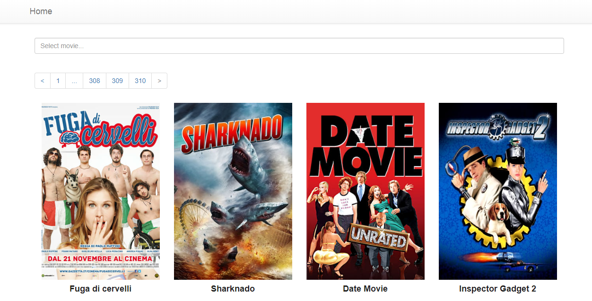

# MovieDB-React-App
A basic application that displays a list of movies as a list of cards from [TMDB](https://www.themoviedb.org). 
Each card provides movie detail such as title, subtitle, description, image.


This is a good example of using nested components, Redux, Rouning in React. 
A MovieBrowser component has a SearchBox component and a MovieList container, that has a MovieCard component. 
The MovieList container uses a api to retrieve a list of movies (with async reducers and axios), list of movies store to redux store.

For styling, I have adopted bootstrap-react. I use CSS for all custom written styles.

### The application is composed of the following components:

MovieBrowser - A root component that displays application title, search and list of movies.

MovieList - Groups a collection of movies (used api for connect with axios to [TMDB](https://www.themoviedb.org))

MovieCard - Represents a single instance of a movie

SearchBox - Represents a search box for searchin movie

MovieDetail - Rerpresents a single Movie from [TMDB](https://www.themoviedb.org)) and list of recommends movies

**Screenshots:**

 
 ***Search***
 
 
 ***Detail***
 
 
 ***On Hover***
 
 
### API:
- createMovieDbUrl - Returns URL to connect to [TMDB](https://www.themoviedb.org)

  example: ```createMovieDbUrl('/movie/top_rated', {1});``` return https://api.themoviedb.org/3/movie/top_rated?api_key=YOUR_MOVIEDB_KEY&language=en-US&page=1
- getTopMovies - async function returns response from [https://developers.themoviedb.org/3/movie/top_rated](https://developers.themoviedb.org/3/movie/top_rated)
- searchMovies - async function returns response from [https://developers.themoviedb.org/3/search/movie](https://developers.themoviedb.org/3/search/search-movies)
- getMovieDetails - async function returns response from [https://developers.themoviedb.org/3/movies/get-movie-details](https://developers.themoviedb.org/3/movies/get-movie-details)
- getGenres - async function returns response from [https://developers.themoviedb.org/3/genres](https://developers.themoviedb.org/3/genres)

## Developed With

* [React](https://reactjs.org/) - A javascript library for building user interfaces
* [React-Bootstrap](https://react-bootstrap.github.io/) - Bootstrap is an open source toolkit for developing with HTML, CSS, and JS
* [Axios](https://github.com/axios/axios) - Promise based HTTP client for the browser and node.js
* [Redux](https://redux.js.org/) - Redux is a predictable state container for JavaScript apps.
* [Redux-Thunk](https://github.com/reduxjs/redux-thunk) - Thunk middleware for Redux

## Getting Started

These instructions will get you a copy of the project up and running on your local machine for development and testing purposes.

### Prerequisites

The following software is required to be installed on your system:

* Node 8.x
* Npm 3.x

Type the following commands in the terminal to verify your node and npm versions

```bash
node -v
npm -v
```

### Install

Follow the following steps to get development environment running.

* Clone _'moviedb-app'_ repository from GitHub

  ```bash
  git clone https://github.com/kuric/moviedb-app.git
  ```

   _OR USING SSH_

  ```bash
  git clone git@github.com:kuric/moviedb-app.git
  ```

* Install node modules

   ```bash
   cd moviedb-app
   npm install
   ```
   _OR_
    ```bash
    cd moviedb-app
    yarn install
    ```
### Build

* Build application

  This command will also run ESLint as part of build process.

  ```bash
  npm run build
  ```
     _OR_
    ```bash
    yarn build
    ```

### Run

* Run start

  This will run the _'serve'_ npm task

  ```bash
  npm start
  ```
    _OR_
   ```bash
   yarn start
   ```
---
